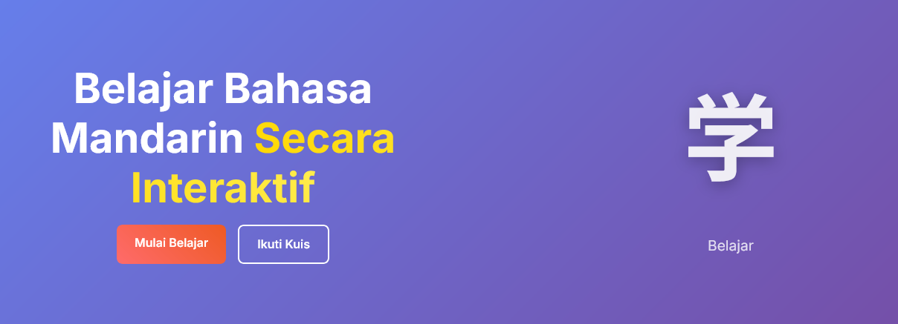
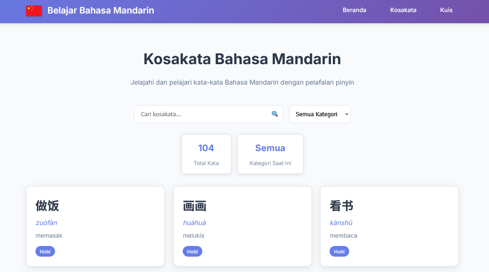
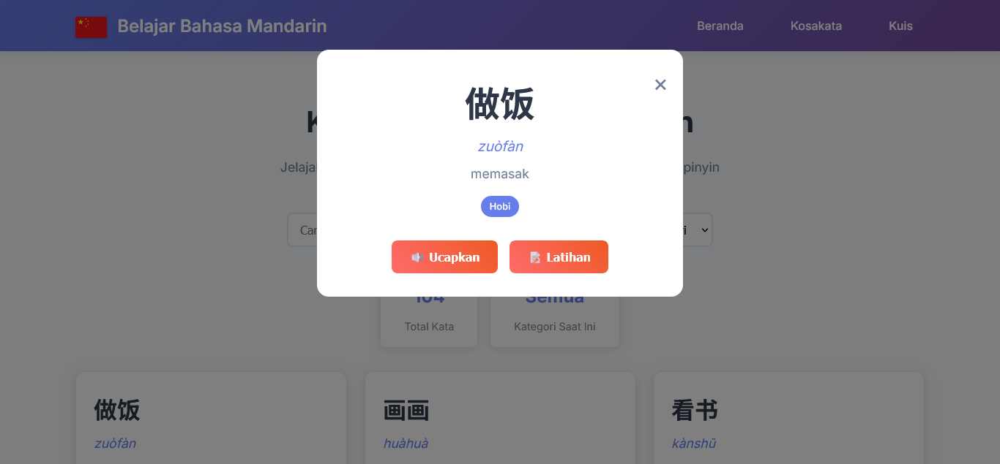
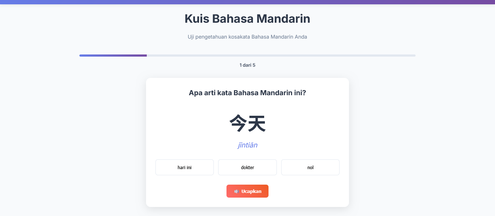
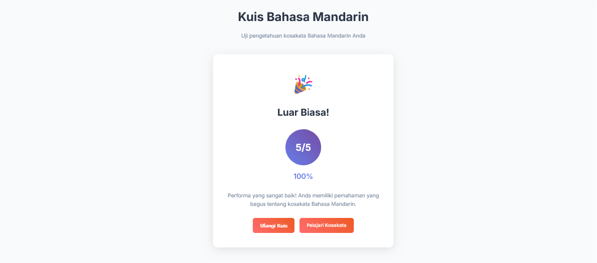

# Chinese Learning App

> An interactive web application for learning Mandarin through engaging vocabulary lessons and fun quizzes.
Built with Flask, HTML, CSS, and JavaScript to make language learning more enjoyable and accessible! 🧠✨
---



## Key Features
### Vocabulary
- 100+ Mandarin words with Hanzi, Pinyin, and translations
- Search by Hanzi, pinyin, or meaning
- Filter by categories (greetings, numbers, colors, animals, nature)
- Word detail modal with pronunciation feature

### Interactive Quiz
- Multiple-choice quiz with 5 random questions
- Real-time feedback and scoring system
- Text-to-Speech for pronunciation

---

## Tech Stack
### Backend
- **Flask** - Python web framework
- **Python 3.12**

### Frontend
- **HTML5** - Page structure
- **CSS3** - Styling
- **JavaScript (ES6+)** - Interactivity and API calls
- **Google Fonts** - Inter & Noto Sans SC

### Browser Features
- **Web Speech API** - Pronunciation (Text-to-Speech)
- **Fetch API** - AJAX requests

---

## Installation & Setup
### Requirements
- Python 3.7 or newer
- ```pip``` (Python package manager)

### Steps
```bash
# Clone or download the repository
git clone https://github.com/ansmlptr/Website-Belajar-Mandarin.git
cd Website-Belajar-Mandarin

# Install dependencies
pip install -r requirements.txt

# Run the Flask app
python app.py

# Open your browser and visit:
http://localhost:5000
```

---
## Project Structure

```
Website-Belajar-Mandarin/
│
├── app.py                 # Main Flask application
├── requirements.txt       # Python dependencies
├── README.md              # Project documentation
│
├── templates/             # HTML templates
│   ├── base.html          # Base template
│   ├── index.html         # Homepage
│   ├── vocabulary.html    # Vocabulary page
│   └── quiz.html          # Quiz page
│
└── static/                # Static files
    ├── css/
    │   └── style.css      # Main stylesheet
    └── js/
        ├── main.js        # Main JavaScript
        ├── vocabulary.js  # Vocabulary functionality
        └── quiz.js        # Quiz functionality
```
---

## API Endpoints
| Method  | Endpoint          | Description                                             |
| ------- | ----------------- | ------------------------------------------------------- |
| **GET** | `/`               | Main homepage                                           |
| **GET** | `/vocabulary`     | Vocabulary page                                         |
| **GET** | `/quiz`           | Quiz page                                               |
| **GET** | `/api/vocabulary` | Get all vocabulary data *(optional filter: `category`)* |
| **GET** | `/api/quiz`       | Get 5 random quiz questions                             |
| **GET** | `/api/categories` | Get all vocabulary categories                           |

---

## Vocabulary Data
This application provides basic Mandarin vocabulary divided into 8 categories:
1. Days — Days of the week 
2. Countries — Common country names
3. Time — Time-related words
4. Months — Month names 
5. Numbers — Numbers from 1 to 10 
6. Hobbies — Popular hobbies
7. Professions  — Job and profession names 
8. Greetings — Common greetings

---

## Browser Support
- Chrome 60+

## Website Pages
| Page                 | Screenshot |
| -------------------  |  ---------- |
| **Vocabulary**    |   |
| **Modal**         |   |
| **Quiz**          |  |
| **Result**        |  |

---

## Developer
- **Name**: Anisa Amalia Putri
- **Email**: [ansmlptr03@gmail.com](mailto:ansmlptr03@gmail.com)

**Made with ❤️ for all Mandarin learners**
_Happy Learning! 加油! (Jiāyóu!)_
